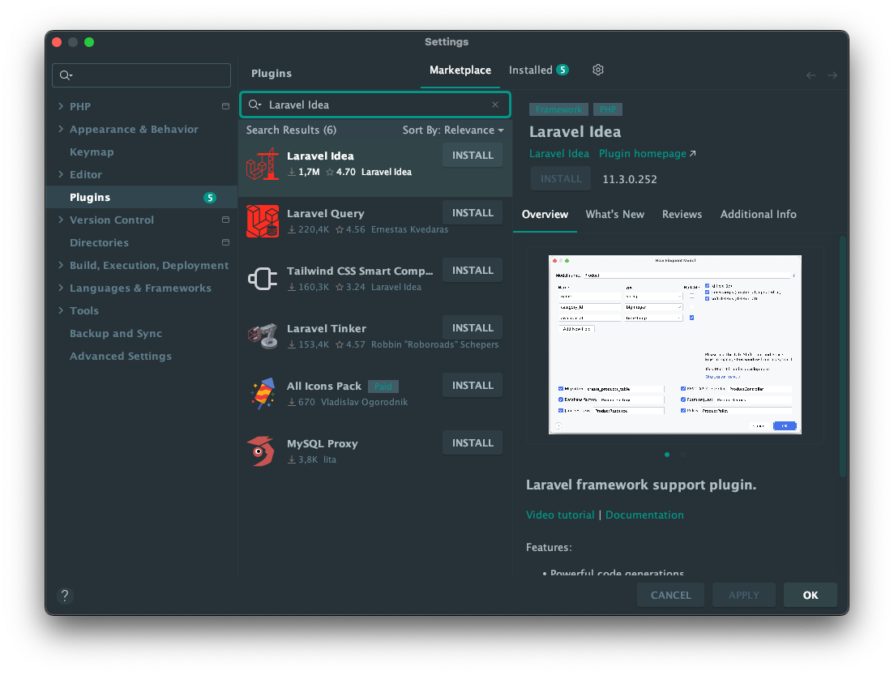

# Installatieproces

Een requirement voor het werken met Laravel is [Composer](https://getcomposer.org/). Met de installatie van [Herd](https://herd.laravel.com/), is composer ook meteen geïnstalleerd. Dit kun je controleren door naar Terminal / Powershell te gaan en ```Composer``` in te tikken. Wanneer je een lijst met woorden ziet, is de installatie gelukt.  

## Project aanmaken

Navigeer naar een locatie op je harde schijf die niet wordt gesynchroniseerd door bijvoorbeeld OneDrive. Een Laravel-project kan veel bestanden bevatten die allemaal gesynchroniseerd gaan worden. Het is ook niet nodig omdat je het project gaat toevoegen aan GIT. Kies een andere map (gewoon op c:/school ) waar je dit soort projecten opslaat.

Met het volgende command in de Terminal maak je een nieuw project aan op de locatie waar je op dat moment staat.

```bash
composer create-project laravel/laravel naam-van-je-project
```

Na het uitvoeren van het commando wordt in de map waar je staat een nieuwe folder gemaakt met de naam: **naam-van-je-project**

Open deze map in PHPStorm. Let erop dat de map met die naam de eerste folder is die je ziet in het overzicht van het project in PHPStorm.


## Database

Bij het aanmaken van een nieuw project wordt er ook direct een database aangemaakt in de vorm van SQLite. Dit is een database dat in een bestand wordt opgeslagen en waar geen databaseserver voor nodig is zoals bij MySQL of MariaDB.

Om in de database te kunnen 'kijken' of bewerkingen te kunnen doen, kun je deze toevoegen als datasource in PHPStorm. Klik in PHPStorm op het database icoontje in de rechts in de tool window.


Je kunt het bestand `database/database.sqlite` links uit je project slepen naar dit venster. Het wordt dan automatisch toegevoegd.

De database wordt toegevoegd en je kunt de tabellen bekijken onder _database.sqlite > main > tables_. Dubbelklik op de tabel om de inhoud te bekijken.

### Projectsettings

Een laravel project heeft een aantal basisinstellingen die je kunt vinden in het `.env` bestand. Dit bestand bevat bijvoorbeeld de (login)gegevens van de database. Dit bestand mag je niet toevoegen aan je repository omdat hier gevoelige informatie in staat. Daarom staat het standaard in de `.gitignore` file. 
Open het `.env` bestand en verander de `APP_NAME`

```bash
# Algemeen
APP_NAME=projectnaam # bedenk hier zelf een passende naam
APP_ENV=local
APP_KEY=base64:AvFlHWzYakMYu4UiGqrn8FzYXxfR3hzm3wgDY2k74= #Dit wordt gegenereerd
APP_DEBUG=true
APP_URL=http://localhost

# database
# De basisgegevens voor de database staan goed voor local development
DB_CONNECTION=sqlite
# DB_HOST=127.0.0.1
# DB_PORT=3306
# DB_DATABASE=laravel
# DB_USERNAME=root
# DB_PASSWORD=
```

## Breeze toevoegen 

Breeze is een starter kit om authenticatie (registreren, inloggen, enz. ) toe te voegen aan jouw Laravel project. 

Voer het volgende commando uit om breeze toe te voegen aan de `require-dev` dependencies in `composer.json`.  

```bash
composer require laravel/breeze --dev
```

Installeer alle benodigde onderdelen als `Controllers`, `Views`, `Routes` en meer...

```bash
php artisan breeze:install
```

Je kunt kiezen voor de volgende opties. Dark / Light mode is een persoonlijke keuze. 


## Development server starten

Om het resultaat van het Laravel project in de browser te kunnen zien, heb je een php server nodig. Deze wordt meegeleverd in het Laravel project en is met een commando in de **terminal** te starten

```bash
composer run dev
```

De server wordt gestart en het url wordt weergegeven in de terminal. [http://127.0.0.1:8000](http://127.0.0.1:8000). Klik hierop om de pagina te openen. 

Naast de webserver wordt met `composer run dev` ook vite gestart. Hierdoor worden css en js bestanden gecompileerd en blijven deze na wijzigingen up-to-date.

Als het goed is zie je nu de default startpagina van Laravel.

**Gefeliciteerd, de installatie is geslaagd!**

## Laravel Idea Plugin
Gratis bonus tip! Maak gebruik van de Laravel Idea Plugin voor PhpStorm. Deze plugin zorgt voor extra functionaliteit in PhpStorm 
die specifiek voor Laravel is.

Ga naar PhpStorm > Settings > Plugins. In het scherm dat opent kies je bovenin voor Marketplace. In de zoekbalk tik je: Laravel Idea. Installeer de plugin.




