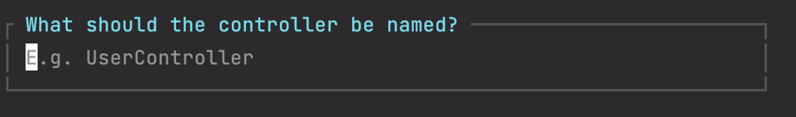

# Nieuw project met Route, Controller en eerste View

Mocht je dit nog niet gedaan hebben start dan een nieuw project volgens de instructies van de  [installatie](./installatie.md).

Zorg dat de server is gestart en dat je het project kunt zien in de browser

```bash
composer run dev
```

## route (en eerste view)

- Open `web.php`
- Maak eerst een route.

  ```php
  Route::get('/about-us', function() {
      return 'About us';
  });
  ```

- Ga naar de browser en bekijk het resultaat van deze return. Vergeet niet `/about-us` toe te voegen aan de URL.
- Vervang return door `return view('about-us');`
- Maak de view aan via het contextmenu. Beweeg de muis over `'about-us'` (of gebruik `ALT` + `ENTER`) en klik op `create view`.
- Voeg HTML-inhoud toe aan de view. Voor dummy-inhoud kun je `lorem` gebruiken en op tab drukken.

    ```html
    <h1>About us</h1>
    <p>Lorem ipsum dolor sit amet, consectetur adipisicing elit. Aperiam, atque autem blanditiis consequatur cumque dolorum eaque eius eligendi enim eos est eum ex explicabo facere fugiat fugit harum id impedit in ipsa iusto laboriosam laborum magnam magni maiores minus molestias natus nemo nesciunt nihil nisi nobis non nulla numquam obcaecati odit officia officiis optio pariatur perspiciatis placeat porro praesentium quae quam quasi qui quia quidem quisquam quo ratione recusandae rem repellat repudiandae rerum saepe sapiente sequi similique sit soluta sunt suscipit tempora tenetur totam ullam unde vel veniam veritatis voluptas voluptate voluptatem voluptatum.</p>
    ```
- Bekijk het resultaat in de browser.

## Nieuwe Controller Aanmaken

Open de terminal in PhpStorm en open een nieuw terminalvenster door op de plus te drukken naast het venster waar je `composer run dev` hebt gestart.

```bash
php artisan make:controller
```


*Gebruik Upper Camel Case voor de naam omdat dit een Class-bestand is.*

- Voer de naam *BlogController* in
- Kies **Empty** controller.

Maak ook een route aan voor de blogs
```php
Route::get('blogs', [\App\Http\Controllers\BlogController::class, 'index']);
```

**Bewerk BlogController**

- Open `/app/Https/Controllers/BlogController`
- Maak een `index()` functie aan (Zie Laravel documentatie hoe functies aangemaakt moeten worden in een [Controller](https://laravel.com/docs/12.x/controllers#basic-controllers))
- return de string `‘My blogs’`.
- Controleer in de browser of de route werkt.
